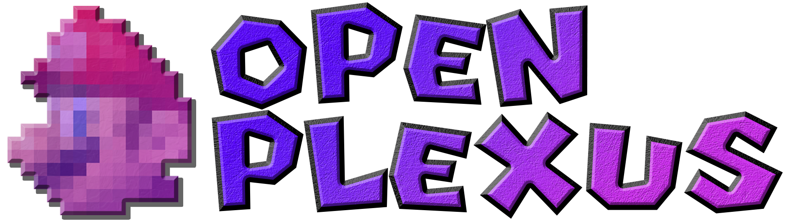

# Open Plexus (i need help boss 🙏)

- This is what i have wanted ever since b3313 first came out
- I (the owner of the repo) want it so that anyone can add new areas or levels or events (ill get to that) to the game.
- I also have absolutely no coding experiance beyond html5+css, block coding, and vibe coding, which, figures, doesn't work. So that isnt good i dont think
- Anyway the game should open as literally base sm64, but have slight changes that occur randomly like maybe the frames around paintings changing colors or corridors getting slightly longer (god i sound like ai) until you reach 70 stars, at which point the game drastically opens up and a new area opens up. I want the castle to have many "mount points" where randomly a door can just appear and take the player to a point in the plexus.
- I dont want the random events to be very common as most of them would be permanent changes until the save file is cleared, like map changes. Paintings should not be tied to the area they are in, but rather the level they lead to. Each level should either choose from a selection of paintings from base sm64 or have their own paintings made for them.

## Open Plexus Framework Starter

A starter framework scaffold for data-driven Open Plexus content is available in:

- `docs/plexus-framework.md`
- `enhancements/plexus_framework/`

This defines an initial pack schema and example manifest so contributors can begin adding mount points, events, and painting mappings in a consistent format.

This repo does not include all assets necessary for compiling the game.
A prior copy of the game is required to extract the assets.

## Building native executables

### Linux

1. Install prerequisites (Ubuntu): `sudo apt install -y git build-essential pkg-config libusb-1.0-0-dev libsdl2-dev`.
2. Clone the repo: `git clone https://github.com/sm64-port/sm64-port.git`, which will create a directory `sm64-port` and then **enter** it `cd sm64-port`.
3. Place a Super Mario 64 ROM called `baserom.<VERSION>.z64` into the repository's root directory for asset extraction, where `VERSION` can be `us`, `jp`, or `eu`.
4. Run `make` to build. Qualify the version through `make VERSION=<VERSION>`. Add `-j4` to improve build speed (hardware dependent based on the amount of CPU cores available).
5. The executable binary will be located at `build/<VERSION>_pc/sm64.<VERSION>.f3dex2e`.

### Windows

1. Install and update MSYS2, following all the directions listed on https://www.msys2.org/.
2. From the start menu, launch MSYS2 MinGW and install required packages depending on your machine (do **NOT** launch "MSYS2 MSYS"):
  * 64-bit: Launch "MSYS2 MinGW 64-bit" and install: `pacman -S git make python3 mingw-w64-x86_64-gcc`
  * 32-bit (will also work on 64-bit machines): Launch "MSYS2 MinGW 32-bit" and install: `pacman -S git make python3 mingw-w64-i686-gcc`
  * Do **NOT** by mistake install the package called simply `gcc`.
3. The MSYS2 terminal has a _current working directory_ that initially is `C:\msys64\home\<username>` (home directory). At the prompt, you will see the current working directory in yellow. `~` is an alias for the home directory. You can change the current working directory to `My Documents` by entering `cd /c/Users/<username>/Documents`.
4. Clone the repo: `git clone https://github.com/sm64-port/sm64-port.git`, which will create a directory `sm64-port` and then **enter** it `cd sm64-port`.
5. Place a *Super Mario 64* ROM called `baserom.<VERSION>.z64` into the repository's root directory for asset extraction, where `VERSION` can be `us`, `jp`, or `eu`.
6. Run `make` to build. Qualify the version through `make VERSION=<VERSION>`. Add `-j4` to improve build speed (hardware dependent based on the amount of CPU cores available).
7. The executable binary will be located at `build/<VERSION>_pc/sm64.<VERSION>.f3dex2e.exe` inside the repository.

#### Troubleshooting

1. If you get `make: gcc: command not found` or `make: gcc: No such file or directory` although the packages did successfully install, you probably launched the wrong MSYS2. Read the instructions again. The terminal prompt should contain "MINGW32" or "MINGW64" in purple text, and **NOT** "MSYS".
2. If you get `Failed to open baserom.us.z64!` you failed to place the baserom in the repository. You can write `ls` to list the files in the current working directory. If you are in the `sm64-port` directory, make sure you see it here.
3. If you get `make: *** No targets specified and no makefile found. Stop.`, you are not in the correct directory. Make sure the yellow text in the terminal ends with `sm64-port`. Use `cd <dir>` to enter the correct directory. If you write `ls` you should see all the project files, including `Makefile` if everything is correct.
4. If you get any error, be sure MSYS2 packages are up to date by executing `pacman -Syu` and `pacman -Su`. If the MSYS2 window closes immediately after opening it, restart your computer.
5. When you execute `gcc -v`, be sure you see `Target: i686-w64-mingw32` or `Target: x86_64-w64-mingw32`. If you see `Target: x86_64-pc-msys`, you either opened the wrong MSYS start menu entry or installed the incorrect gcc package.
6. When switching between building for other platforms, run `make -C tools clean` first to allow for the tools to recompile on the new platform. This also helps when switching between shells like WSL and MSYS2.

### Debugging

The code can be debugged using `gdb`. On Linux install the `gdb` package and execute `gdb <executable>`. On MSYS2 install by executing `pacman -S winpty gdb` and execute `winpty gdb <executable>`. The `winpty` program makes sure the keyboard works correctly in the terminal. Also consider changing the `-mwindows` compile flag to `-mconsole` to be able to see stdout/stderr as well as be able to press Ctrl+C to interrupt the program. In the Makefile, make sure you compile the sources using `-g` rather than `-O2` to include debugging symbols. See any online tutorial for how to use gdb.

## ROM building

It is possible to build N64 ROMs as well with this repository. See https://github.com/n64decomp/sm64 for instructions.

## Project Structure
	
	sm64
	├── actors: object behaviors, geo layout, and display lists
	├── asm: handwritten assembly code, rom header
	│   └── non_matchings: asm for non-matching sections
	├── assets: animation and demo data
	│   ├── anims: animation data
	│   └── demos: demo data
	├── bin: C files for ordering display lists and textures
	├── build: output directory
	├── data: behavior scripts, misc. data
	├── doxygen: documentation infrastructure
	├── enhancements: example source modifications
	├── include: header files
	├── levels: level scripts, geo layout, and display lists
	├── lib: SDK library code
	├── rsp: audio and Fast3D RSP assembly code
	├── sound: sequences, sound samples, and sound banks
	├── src: C source code for game
	│   ├── audio: audio code
	│   ├── buffers: stacks, heaps, and task buffers
	│   ├── engine: script processing engines and utils
	│   ├── game: behaviors and rest of game source
	│   ├── goddard: Mario intro screen
	│   ├── menu: title screen and file, act, and debug level selection menus
	│   └── pc: port code, audio and video renderer
	├── text: dialog, level names, act names
	├── textures: skybox and generic texture data
	└── tools: build tools

## Contributing

Pull requests are welcome. For major changes, please open an issue first to
discuss what you would like to change.
